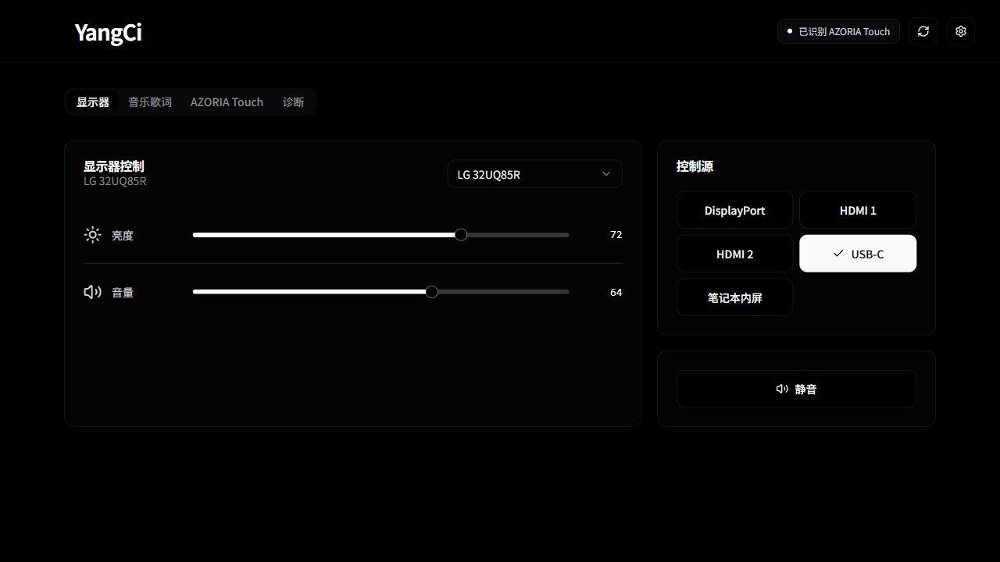
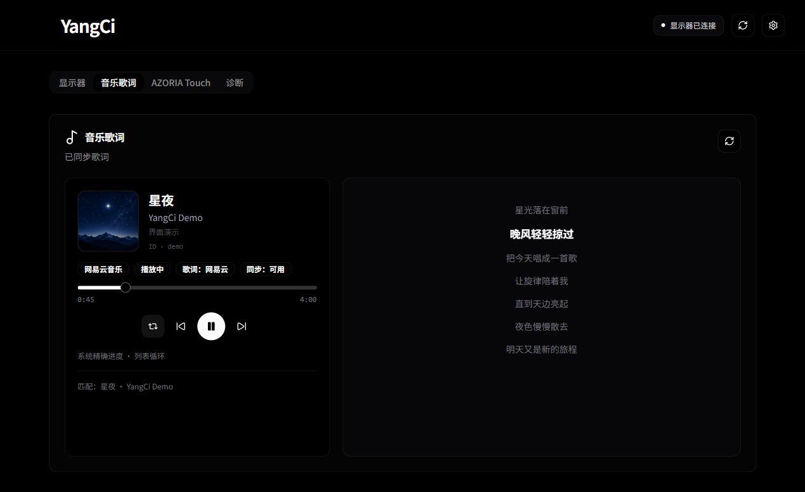
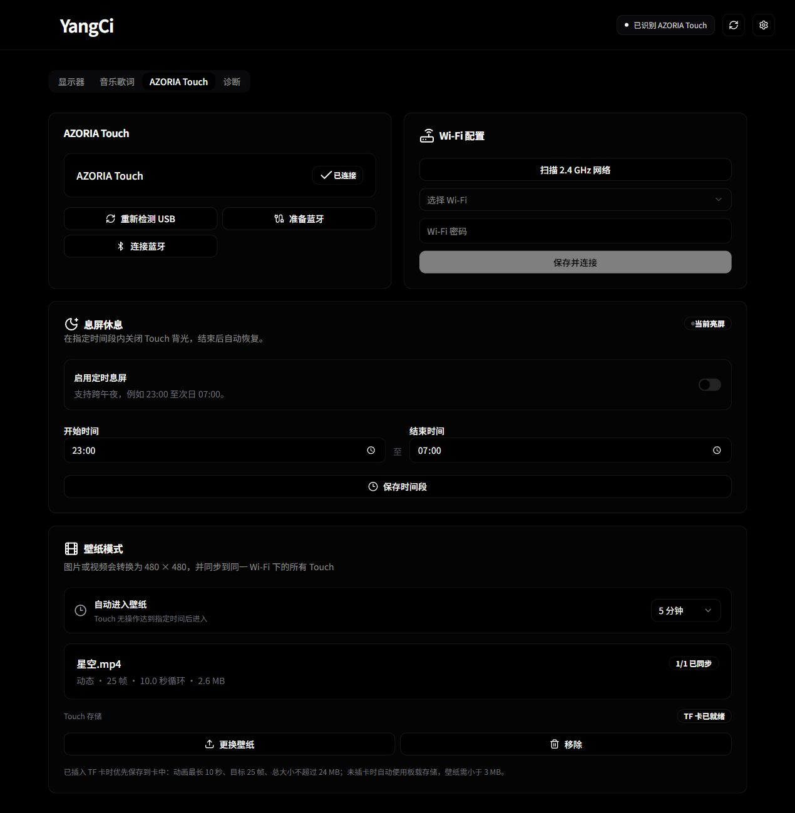
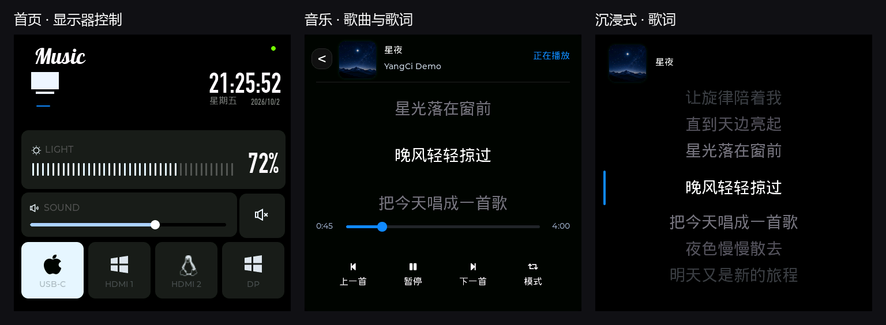

# YangCi

> Origin and thanks: this project started from [ayedaren/azoria](https://github.com/ayedaren/azoria)
> and has since evolved through substantial changes to the desktop app, hardware
> control, and Touch firmware.

<div align="center">

**A local-first control center for modern desktop displays.**

[](LICENSE)
[](https://github.com/Yang-Ci/azoria_Pro/actions/workflows/ci.yml)
[](https://www.electronjs.org/)
[](https://www.espressif.com/en/products/socs/esp32-s3)

[English](README.md) · [简体中文](README.zh-CN.md)

</div>

YangCi brings display controls into one desktop experience. It combines an
Electron control center, a native Rust DDC/CI sidecar, and an optional 480×480
ESP32-S3 touch controller called **AZORIA Touch**.

The desktop app works independently; add Touch to keep display controls, music,
lyrics, and wallpapers within reach. Display control and device communication
stay on the host or trusted private network. Online lyric matching and artwork
lookup contact the corresponding music services and require internet access.

## Desktop app

### Display controls



Choose a display, adjust brightness and audio, toggle mute, and select
DisplayPort, HDMI 1, HDMI 2, USB-C, or the laptop's internal panel target. YangCi
probes video-link DDC/CI and vendor USB HID routes and supports built-in or
imported monitor profiles. External-monitor audio and input support depend on
the monitor. For Windows / Linux internal-panel targets, volume and mute control
the system's default playback device, including headphones.

### Linked brightness, computer status, and background operation

Select displays on the Display page and save independent brightness baselines.
With baselines of 60% and 40%, an offset of +10 points produces 70% and 50%.
The allowed offset is -40 to +40, preserving the 20-point difference at both
limits. Linking uses each display's video DDC/CI or internal-panel interface;
unsupported or disconnected displays report errors independently. Desktop,
Touch, and shortcut adjustments share these settings. Save actual brightness
values as up to 16 scenes and select them from the UI, tray, or shortcuts.

Computer Status samples CPU usage across all cores, used/total memory, and
aggregate receive/send rates on active interfaces every two seconds, with
one-minute trends. Tap **PC Status** on Touch to view the same metrics over
Wi-Fi or BLE. Offline or expired data shows a waiting state. GPU and temperature
support is planned for a later update.

Settings controls whether closing the window keeps YangCi running in the tray.
The tray offers brightness adjustments, scene selection, reopening, and exit.
Global shortcuts are opt-in: Ctrl / Command + Alt + Up / Down adjusts brightness
by five points and Ctrl / Command + Alt + S cycles scenes. Keys are configurable;
conflicts retain the previous settings. Installed Windows / macOS builds also
offer opt-in startup at login, disabled by default.

### Music and lyrics



Read track, artist, album, artwork, and playback progress from system media
sessions, with support for NetEase Cloud Music, QQ Music, and other desktop or
browser players that expose media sessions. Match lyrics through NetEase, QQ
Music, or LRCLIB and highlight the current line as playback advances.

Control previous / next, play / pause, seeking, and playback modes where the
player exposes those capabilities. Click a lyric line to seek; when seeking is
unavailable, clicking can calibrate lyric timing. Connected Touch devices receive
track information, lyrics, and playback state.

### Touch setup, wallpaper, and scheduled sleep



| Feature | What it does |
| --- | --- |
| Device setup | Identify Touch over USB, prepare Bluetooth and connect through BLE; optionally scan and configure 2.4 GHz Wi-Fi over USB for automatic LAN discovery. |
| Still / video wallpaper | Preview the 480×480 crop, adjust its horizontal/vertical position and 1–3× zoom, then save to a local library of up to 100 wallpapers. Preview, display, or delete saved items. TF storage takes priority: videos up to 10 seconds, targeting 25 frames, with a 24 MB package limit; without a card, keep packages under 3 MB. |
| Playlists / scheduled changes | Reorder selected wallpapers, rotate sequentially or randomly at 1-minute to 24-hour intervals, and configure up to 24 daily changes to specific wallpapers. Save settings to apply them. Desktop must stay running and share a LAN with Touch; offline devices retain their last wallpaper. Existing wallpapers migrate automatically. |
| Idle wallpaper | Enter wallpaper after 1, 5, 10, or 30 idle minutes, or disable automatic entry. Tap the wallpaper to return. |
| Scheduled sleep | Configure a backlight-off interval, including overnight schedules; backlight resumes when the interval ends. Disabled by default, with a preset of 23:00–07:00. |
| Screen orientation | In Touch Settings, rotate clockwise by 90° through 0°, 90°, 180°, and 270°. The saved direction syncs over Wi-Fi or BLE; Touch rotates its interface, touch coordinates, and still / video wallpaper together. Requires the updated Touch firmware. |
| Diagnostics | View control success rate, average / P95 latency, route failures, readback mismatches, and recent events. |
| Profiles and development | Use the profile wizard or import a profile in Settings. Enable the normally hidden Developer page to select an application firmware image, verify device identity and file hash, and flash over USB. |

## AZORIA Touch interface



| View | Features and gestures |
| --- | --- |
| Home | Time and connection status, display brightness, audio, mute, and input targets. Swipe down from the top to adjust the small screen's backlight. |
| Music | Tap the **Music** wordmark to see artwork, track information, lyrics, progress, and playback controls. |
| Immersive lyrics | Tap the current lyric to enter a large-text lyric view; tap the page to return to Music. |
| Volume gesture | Swipe down from the top of either music view to adjust volume, synchronized with Home and Desktop. Swipe up or tap × to close and stay on the current page. Home's backlight panel also closes with a swipe up. |
| Wallpaper | Tap the computer icon below Music or wait for the configured idle interval. Tap once to return. |

BLE works independently for everyday controls, track information, and lyrics.
**Artwork and wallpaper synchronization require Touch and Desktop on the same
LAN.** Live playback uses artwork from the player or supported music service;
the documentation's demo cover does not replace live track artwork.

Desktop screenshots render the current React components; Touch screenshots
render the current 480×480 LVGL implementation. Device status, the fictional
track “星夜 / YangCi Demo,” and lyrics are demonstration data, with original demo
artwork. See [screenshot and asset notes](docs/images/README.md).

For the enclosure, print `hardware/enclosure/v3/azoria-touch-all-v3.stl` to produce
the front, rear, and both stand designs on one plate. The [V3 package](hardware/enclosure/v3/)
contains five STL files and [printing instructions](hardware/enclosure/v3/README.md).

The [CUKTECH 10 Ultra charging station package](hardware/enclosure/charging-station-v2/README.md)
adds the charger base, rear panel, cable cover, four reel bays, and adjustable Touch screen.
Rear-cover corrections were synchronized on 2026-10-06. Print the fit coupons before assembly.
[Download the complete station print package](hardware/enclosure/charging-station-v2/cuktech-desktop-station-v2-2026-10-06.zip).

## Architecture and device capabilities

- Electron + React desktop UI with allowlisted IPC into local services.
- Native Rust sidecar for DDC/CI, LG USB HID/DDC, and supported internal-panel controls.
- Optional Touch controller with independent BLE and private-LAN connections.
- Coordinated command execution across multiple Desktop instances, including duplicate-command suppression.
- Firmware BLE OTA service with size and SHA-256 checks; Desktop provides USB application-image flashing.

## How it fits together

```text
┌─────────────────────────┐       BLE / trusted LAN       ┌──────────────────────┐
│         YangCi          │ ◀───────────────────────────▶ │     AZORIA Touch     │
│  Electron + React UI    │                               │ ESP32-S3 + LVGL UI   │
└────────────┬────────────┘                               └──────────────────────┘
             │ allowlisted IPC
             ▼
┌─────────────────────────┐
│    Rust DDC Sidecar     │
│ DDC/CI + USB HID bridge │
└────────────┬────────────┘
             │
             ▼
┌─────────────────────────┐
│     External Display    │
│ Brightness · Audio · I/O│
└─────────────────────────┘
```

## Repository layout

```text
azoria-display-control/
├── desktop/
│   ├── profiles/        # Built-in monitor profiles
│   └── src/
│       ├── main/        # Electron main process and hardware orchestration
│       ├── preload/     # Allowlisted IPC bridge
│       ├── renderer/    # React + shadcn/ui interface
│       └── shared/      # Cross-process contracts
├── firmware/
│   ├── assets/          # Source artwork for firmware assets
│   ├── include/         # Board configuration
│   └── src/
│       ├── features/    # AZORIA Touch product features
│       ├── platform/    # Display and touch hardware adapters
│       ├── services/    # Provisioning, BLE, and device configuration
│       └── ui/          # LVGL components and generated assets
└── sidecar/             # Native Rust DDC/CI and USB HID layer
```

## Getting started

### Prerequisites

- Node.js 22 or later
- A stable Rust toolchain
- PlatformIO, only when building AZORIA Touch firmware

### Run the desktop app

```bash
npm install
npm run sidecar:build
npm run dev
```

On first launch, YangCi creates its local key material and device
configuration inside the application data directory. Wi-Fi credentials, local
keys, and device-specific runtime state are not stored in this repository.

### Build the desktop app

```bash
npm run typecheck
npm run build
```

### Build AZORIA Touch firmware

```bash
cd firmware
pio run -e viewe_uedx48480040e_wb_a
```

The application image is written to:

```text
firmware/.pio/build/viewe_uedx48480040e_wb_a/firmware.bin
```

Select this `firmware.bin` from the **Developer** page in YangCi. Do not
select `bootloader.bin` or `partitions.bin`; those files are not accepted by the
Desktop flashing workflow.

PlatformIO upload can also write the bootloader and partition table. Use it for
initial provisioning or an explicitly requested full recovery. For an existing
device, follow the [application-only update procedure](#touch-application-only-updates)
below and check the real OTA boot slot first. Replace the example port for initial upload:

```bash
cd firmware
pio run -e viewe_uedx48480040e_wb_a -t upload --upload-port /dev/cu.usbmodemXXXX
```

## AI-assisted builds, desktop updates, and Touch flashing

Before asking an AI agent to build, update an installation, or flash Touch, have
it read this section, the [firmware notes](firmware/README.md), and any applicable
`AGENTS.md`. These are the project's operating requirements; ports and drive
letters in examples are not device configuration.

### Scope and environment

- Distinguish source edits, builds, installed desktop updates, Touch flashing,
  GitHub pushes, and Release publication. Carry out steps the user has already
  authorized without repeated confirmation. An application update does not
  authorize a full-chip erase, partition changes, pairing reset, or Wi-Fi
  reprovisioning; those require an explicit request.
- Inspect `git status --short`, the branch, remote, tool versions, installation
  path, and serial devices. Preserve changes from the user and other tasks.
  Select only this task's files or hunks for commits; do not use `git add .`,
  force pushes, `git reset --hard`, or `git clean -fd` to overwrite other work.
- Use locked dependencies. Run `npm ci` when Node dependencies are missing;
  do not upgrade packages or delete lockfiles just to build. Locate existing
  tools before installing replacements. Windows PlatformIO Python usually lives
  at `%USERPROFILE%\.platformio\penv\Scripts\python.exe`, not `penv/bin/python`.
- Check free space on the source, cache, staging, and backup drives.
  `firmware/.pio/build` and `sidecar/target` may be junctions: inspect their
  targets with `Get-Item` before cleanup or migration. A PlatformIO temporary
  directory cleanup warning is not a reason to recursively delete the target;
  inspect the exit code and final build result.
- Use a unique staging / backup directory outside the repository. Record the
  source commit, uncommitted changes, build results, and artifact SHA-256 values.
  Do not mix outputs from tasks concurrently changing the same source or build
  directories; pin the source and artifacts for this update. Routine testing
  does not require a version bump. For a release, coordinate `package.json`,
  `package-lock.json`, `firmware/version.txt`, and `CHANGELOG.md`.

### Builds and artifact checks

Choose checks appropriate to the changes. When both desktop and sidecar change,
run these from the repository root:

```bash
npm run typecheck
node --test desktop/tests/*.test.cjs
npm run sidecar:test
npm run build
```

Also run `npm run usage:test` for Codex / API quota changes. Build firmware separately:

```bash
pio run --project-dir firmware -e viewe_uedx48480040e_wb_a
```

On Windows, if `pio` is not on PATH, use the existing Python from the repository root:

```powershell
$pioPython = Join-Path $env:USERPROFILE '.platformio\penv\Scripts\python.exe'
& $pioPython -X utf8 -m platformio run --project-dir firmware -e viewe_uedx48480040e_wb_a
if ($LASTEXITCODE -ne 0) { throw 'Firmware build failed; stop installation and flashing' }
```

`npm run build` refreshes both `out/` and `sidecar/target/release/`.
`npm run desktop:build` refreshes only Electron output and is insufficient after
Rust changes. Use this build's `firmware.bin`; check the ESP32-S3 type, application
description, and integrity with `image-info`, and check its size against the
actual application partition. Bootloader, partition-table, and merged images
are not application images. A version string, cached compilation timestamp, or
filename alone does not establish that an artifact contains the latest source.

### Updating an installed desktop app

1. Identify the running executable and actual installation directory. Back up
   `resources/app.asar`, relevant `app.asar.unpacked` native dependencies, and
   `resources/sidecar/`, plus `app.getPath("userData")` (typically
   `%APPDATA%\YangCi` on Windows). Preserve local keys, API credentials,
   wallpapers and playback, monitor profiles, brightness scenes, sleep,
   orientation, and desktop settings.
2. Prepare a complete package in staging, or repack a compatible installed
   package with the current `out/`, profiles, and icon assets. Reuse native
   modules only when Electron, platform / architecture, and runtime dependencies
   remain compatible; changed dependencies require a complete package rebuild.
   The archive and `app.asar.unpacked` must match, including serial-port modules.
3. Check the sidecar's platform and filename: `azoria-ddc-sidecar.exe` on Windows,
   `azoria-ddc-sidecar` on Linux / macOS. The current `electron-builder.yml` and
   `npm run package:linux` target Linux. Windows packaging needs an explicit
   target and `.exe` resource path; do not copy the Linux resource configuration.
4. Exit YangCi from its tray and verify that processes belonging to this
   installation have exited before replacing files. Closing the window can
   simply hide it. If files remain locked, handle only processes belonging to
   the target installation. Replace using staged files, verify installed hashes,
   and restore backups if replacement fails rather than leaving mixed resources.
5. Restart from the actual installation and show its window. Check the new UI,
   monitor state, Touch connection, and preserved settings. Verify tray operation,
   background sync, and BLE polling with the window closed. Restore temporary
   test settings; do not enable startup, hotkeys, or developer mode without a request.

A successful source build and an updated installation are separate outcomes;
report each accurately.

### Touch application-only updates

Update only the application slot **confirmed to boot on this device**, preserving
the bootloader, partition table, NVS, OTA metadata, and LittleFS / SD wallpapers.
Rediscover the device each time; never reuse an old COM port or assume `app0`.

1. Enumerate serial devices, confirm a working Touch with the USB
   `AZORIA_IDENTIFY` → `AZORIA_TOUCH_V1` handshake, and use esptool to check the
   ESP32-S3 identity, MAC, and flash capacity. Recovery of a device that cannot
   respond needs additional board identification. A Windows USB interface
   instance / `serialNumber` is not necessarily the chip MAC; equality is not
   a reliable identity test.
2. Read and back up the real boot-control region. Parse its partition table and
   `otadata`, validate OTA record CRCs, states, and sequences, and establish the
   next boot slot. Normal dual-OTA selection uses a valid `ota_seq`, with slot
   `(ota_seq - 1) % 2`. Investigate blank, damaged, rollback-pending, or ambiguous
   records before choosing an address.
3. Back up the target application partition. Copy the new build into its own
   staging directory, inspect it, and hash it. Recheck that hash immediately
   before writing, then write only the verified application offset.
4. On Windows, invoke Python / esptool with `-X utf8` to avoid GBK failures on
   progress characters. Explicitly use `--flash-mode keep --flash-freq keep
   --flash-size keep`. Validated boards boot with DIO; do not force QIO into the
   image header because `platformio.ini` says QIO, as this can cause boot loops.

The expected [repository partition layout](firmware/partitions.csv) is below.
**Compare it with the table read from the actual device.**

| Partition | Offset | Size | Routine application update |
| --- | --- | --- | --- |
| NVS | `0x9000` | `0x5000` | Preserve Wi-Fi, pairing, and device settings |
| OTA metadata | `0xE000` | `0x2000` | Read and preserve; do not blindly rewrite |
| `app0` | `0x10000` | `0x640000` | Write only if confirmed as the boot slot |
| `app1` | `0x650000` | `0x640000` | Write only if confirmed as the boot slot |
| `spiffs` / LittleFS | `0xC90000` | `0x360000` | Preserve onboard wallpapers |
| Coredump | `0xFF0000` | `0x10000` | Preserve |

This **esptool 5.x / PowerShell** example runs from the repository root. Replace
`COM8` and drive D with verified local values. The first block only stages the
image, checks identity, and reads a backup; it does not flash:

```powershell
$pioPython = Join-Path $env:USERPROFILE '.platformio\penv\Scripts\python.exe'
$port = 'COM8' # Replace with the Touch port verified for this operation
$backupDir = Join-Path 'D:\Touch-Backups' (Get-Date -Format 'yyyyMMdd-HHmmss')
New-Item -ItemType Directory -Path $backupDir -ErrorAction Stop | Out-Null
$builtFirmware = (Resolve-Path -LiteralPath 'firmware/.pio/build/viewe_uedx48480040e_wb_a/firmware.bin').Path
$firmware = Join-Path $backupDir 'firmware-staged.bin'
Copy-Item -LiteralPath $builtFirmware -Destination $firmware -ErrorAction Stop

& $pioPython -X utf8 -m serial.tools.list_ports
& $pioPython -X utf8 -m esptool --chip esp32s3 --port $port flash-id
if ($LASTEXITCODE -ne 0) { throw 'Device verification failed' }
& $pioPython -X utf8 -m esptool image-info $firmware
if ($LASTEXITCODE -ne 0) { throw 'Image inspection failed' }
$firmwareHash = (Get-FileHash -LiteralPath $firmware -Algorithm SHA256).Hash
$bootControl = Join-Path $backupDir 'boot-control.bin'
& $pioPython -X utf8 -m esptool --chip esp32s3 --port $port --baud 921600 read-flash 0x0 0x10000 $bootControl
if ($LASTEXITCODE -ne 0) { throw 'Boot-control backup failed' }
```

Parse `$bootControl` before proceeding; it contains private NVS data and must
stay local. The variables below are deliberately unset until the real device
values have been checked. For the table above, the application size is
`0x640000`, and its offset is the confirmed boot slot at `0x10000` or `0x650000`:

```powershell
$appOffset = $null # Set from the verified device partition table and OTA state
$appSize = $null   # Set to that application partition's size
if ($null -eq $appOffset -or $null -eq $appSize) { throw 'Verify the partition and OTA boot slot first' }
if ((Get-Item -LiteralPath $firmware).Length -gt $appSize) { throw 'Image exceeds application partition' }
$previousApp = Join-Path $backupDir 'previous-app.bin'
& $pioPython -X utf8 -m esptool --chip esp32s3 --port $port --baud 921600 read-flash $appOffset $appSize $previousApp
if ($LASTEXITCODE -ne 0) { throw 'Previous application backup failed' }
if ((Get-FileHash -LiteralPath $firmware -Algorithm SHA256).Hash -ne $firmwareHash) { throw 'Staged image changed' }
& $pioPython -X utf8 -m esptool --chip esp32s3 --port $port --baud 921600 write-flash --flash-mode keep --flash-freq keep --flash-size keep $appOffset $firmware
if ($LASTEXITCODE -ne 0) { throw 'Flash failed; preserve the log and investigate' }
```

Require both exit code zero and successful write verification; 100% progress
alone is insufficient. Use `verify-flash` for an additional check when needed.
After reboot, rediscover serial ports, check the 115200-baud identity handshake,
and verify Wi-Fi / BLE, pairing, wallpapers, and the changed feature. Diagnose
startup logs and port identity before trying another write; repeated erases or
reprovisioning are not a substitute for diagnosis.

The desktop Developer flasher currently writes only `0x10000`, and its tool
paths and USB identity handling differ across platforms. Use it only after
checking tools, identity, and the `app0` boot slot. If Windows tool discovery or
its instance-string / MAC comparison fails, perform the independent checks
above before using esptool; do not bypass identity checks. Routine updates do
not use `erase-flash`, `-t erase`, filesystem upload, or full PlatformIO upload.

### Verification and delivery

Verify the changed flow end to end: UI → IPC / protocol → sidecar / firmware →
readback or screen. Distinguish simulation from hardware evidence; do not claim
physical dual-display validation without testing two physical displays. Record
the source version, desktop / firmware hashes, backup location, flashed slot,
verification results, and remaining user tests. Documentation-only edits need
command, link, and description checks, not another build, installation, or flash.

When the user requests a GitHub upload, commit only this task's source, tests,
and documentation, then verify the remote commit matches locally. Do not commit
`out/`, `.pio/`, `target/`, installers, private backups, credentials, serial logs,
or temporary verification output. Release firmware belongs in a separate Release
asset. Report built, installed, flashed, and pushed outcomes independently.

## Hardware status

| Component | Validated hardware |
| --- | --- |
| AZORIA Touch board | VIEWE UEDX48480040E-WB-A V1.3 |
| Display panel | 480×480 GC9503 RGB LCD |
| Touch controller | FT6336U |
| Memory | 16 MB Flash / 8 MB PSRAM |
| External monitor | LG 32UQ85R |

Other monitors may work through standard DDC/CI, but model-specific input codes
and USB HID mappings must be verified on real hardware before being added as a
built-in profile.

## Display transport model

YangCi expresses brightness, volume, mute, and input selection as DDC/CI VCP
features. A monitor can expose those features over either:

- `usb-hid-ddc` — vendor USB HID transport carrying DDC/CI messages;
- `video-ddc` — DDC/CI over HDMI, DisplayPort, or USB-C video links.
- `internal-panel` — native laptop panel controls.

YangCi probes the available transports and selects one verified path for the
entire monitor. It does not mix transport paths between individual controls.
If the active path fails and another path is confirmed, all controls move to
the fallback path together.

The desktop app enumerates DDC/CI-capable displays and native internal panels,
then lets you select the active target in the control view or Profile wizard.
On Windows, brightness reads `WmiMonitorBrightness` and writes through
`WmiSetBrightness`; volume and mute use Core Audio (WASAPI). On Linux, panels are
identified from connected eDP/LVDS/DSI connectors and their system backlight
device, not from monitor model names. Brightness writes try the system backlight
interface and then the desktop's brightness service, while volume and mute use
PipeWire/PulseAudio. Both platforms control the current default playback device
and keep input switching disabled.

Common VCP features:

| Capability | VCP opcode | JSON decimal |
| --- | --- | ---: |
| Brightness | `0x10` | `16` |
| Volume | `0x62` | `98` |
| Mute | `0x8D` | `141` |
| Input source | `0x60` | `96` |

Monitor profiles live in [`desktop/profiles/`](desktop/profiles). They contain
identification rules, transport priority, VCP mappings, and separate input read
and write mappings. Profile files are validated data only: they cannot define
commands, executable paths, dynamic libraries, or network addresses.

### Profile wizard roadmap

| Step | Direction | Status |
| --- | --- | --- |
| 1 | Read the monitor identity and available DDC/CI transports. | Done |
| 2 | Match a validated built-in profile automatically. | Done |
| 3 | Import and validate a custom JSON profile. | Done, basic |
| 4 | Build the interactive step-by-step profile wizard. | Done, first version |
| 5 | Generate a reusable profile file from wizard results. | Planned |
| 6 | Verify on real hardware, then promote it to a built-in or shared profile. | Planned |

See the [Chinese reference](README.zh-CN.md#显示器配置表) for the complete profile
schema and the validated LG 32UQ85R mapping.

## Connectivity and security

- BLE and Wi-Fi can independently connect AZORIA Touch to YangCi.
- LAN coordination uses TCP `8732`, UDP `8733`, and UDP `8734`.
- Network services reject public-source traffic and are intended only for a
  trusted private network.
- The LAN protocol does not provide authentication. Do not expose its ports to
  untrusted networks or the public internet.
- The Electron renderer has no direct Node.js access; hardware operations cross
  an allowlisted IPC boundary.
- Diagnostic logs omit Wi-Fi passwords, local keys, device MAC addresses, and
  complete firmware paths. Logs are stored locally and are not uploaded.

For reporting security issues, see [SECURITY.md](SECURITY.md).

## Development

```bash
npm run typecheck
npm run desktop:build
npm run sidecar:test
```

Contributions that improve monitor compatibility, hardware support, stability,
testing, and documentation are welcome. Please read [CONTRIBUTING.md](CONTRIBUTING.md)
and [CODE_OF_CONDUCT.md](CODE_OF_CONDUCT.md) before opening a pull request.

## License

YangCi is licensed under
[GPL-3.0-or-later](LICENSE). Third-party libraries, hardware names, trademarks,
and artwork remain subject to their respective licenses and rights.
