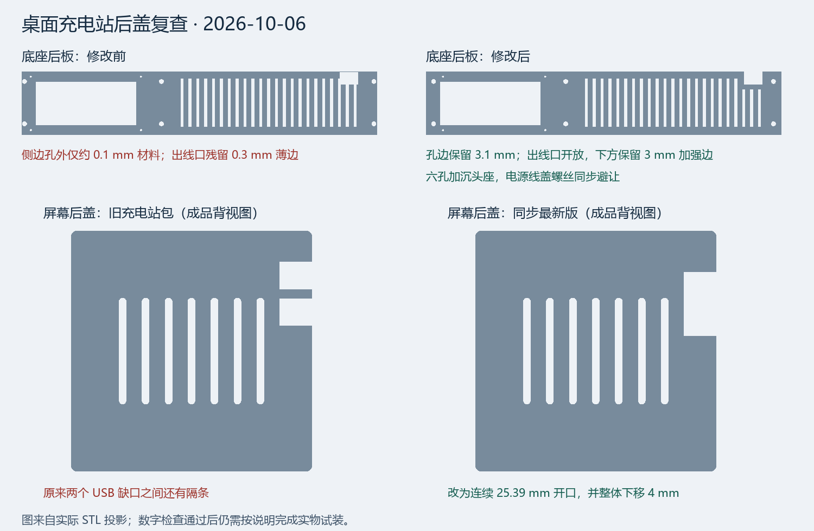
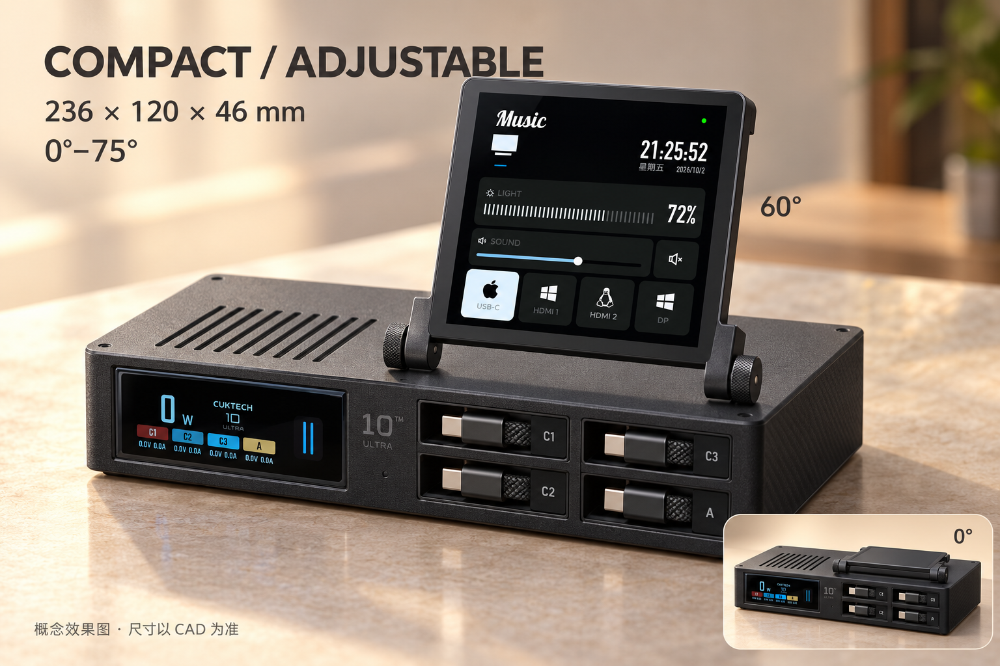

# 酷态科 10 Ultra + YangCi Touch 紧凑可调角度工作站 V2

这一版只做可翻起屏幕的款式。底座平放，充电器的 **76 × 33 mm 窄屏幕面横向朝前**，右侧是四个伸缩线仓。新增的 4 英寸控制屏位于右上方，通过两颗金属旋钮螺栓调角度。充电器保持完整，原插脚接成品延长线的母头，电源线从后盖引出。

这是用于试装的原创 CAD 原型，尺寸按零件资料建立；尚未做实物试装、散热和铰链寿命验证。数字模型检查的范围与结果见 `validation/report.json`。效果图用于看外观，所有机械尺寸以 SCAD/STL 为准。

2026-10-06 后盖复查修订：屏幕后盖同步独立 V3 的连续双 USB-C 开口及下移 4 mm
修正；底座后板两侧螺丝中心改为 X=10/226 mm，3.4 mm 通孔到侧边保留 3.1 mm
材料。六个后板孔增加直径 6.4 mm、深 1.5 mm 的沉头座；电源检修盖左侧螺丝移至
X=16 mm，避开后板沉头座。屏幕出线口现在从顶部开放，去掉原有 0.3 mm 薄边，
其下方通风槽缩短以保留 3 mm 加强边。底壳导孔、后板、线盖、源码及 STL 一起更新。
修改后的底壳和后板必须配套使用，后板孔位与旧版不兼容。

## 已确定的布局

| 项目 | 参数 / 方向 |
|---|---|
| 底座 | 宽 236 × 深 120 × 高 46 mm，后部线盖另突出 2.4 mm |
| 屏幕角度 | 相对桌面 0–75°，默认 60°；旋钮摩擦锁紧，无角度定位齿或机械限位 |
| 放平后的总高度 | 约 66 mm，含铰链耳；未计螺栓与可另贴的脚垫 |
| 60°时总高度 | 约 151 mm，未计脚垫 |
| 原充电器 | 官方标称 67 × 76 × 33 mm；在仓内沿 X/Y/Z 为 76.2 × 67.2 × 33.2 mm 的保守参考尺寸 |
| 伸缩线 | 四个参考盒体均按 50 mm 横宽 × 60 mm 前后深 × 15 mm 高，双层排列 |
| 前部开口 | 外观口 52 × 17 mm，内部上下挡边各压住模块 1 mm，出线有效净高 13 mm；C1/C3 在上，C2/A 在下 |
| 新增屏幕 | 项目已有 VIEWE 4 英寸模块：PCB 94 × 94 mm，玻璃 84 × 84 mm；沿用 V3 前框和后盖配合 |
| 屏幕前框 | 主体 99.3 × 99.3 × 15.5 mm；含侧面铰链臂后的打印占地约 113 × 112.05 mm |
| 后部母头参考空间 | 64 × 39 × 31 mm，包含原插脚接合段的暂定外包络，需要实测 |
| 侧面 USB 插头参考 | 插入后的外露长度暂按 24 mm，宽 11 mm，高 9 mm；需要实测 |

充电器前屏是它自己的充电状态显示。新增的 YangCi Touch 屏幕继续用于音乐、显示器亮度、音量和输入源控制，两块屏幕的功能独立。图中数字为示意。

## 打印文件

所有 STL 单位为 **mm**。共用件与可调件合起来是一款产品，不是两个方案。

| 文件 | 数量 | 用途 |
|---|---:|---|
| `common/base.stl` | 1 | 底壳，含四个线仓支撑和充电器定位脚 |
| `common/rear-panel.stl` | 1 | 可拆后板，含通风和电源检修口 |
| `common/ac-cable-cover.stl` | 1 | 电源线盖；U 形口可装入完整的延长线 |
| `common/reel-retainer.stl` | 1 | 四个线仓的后挡片，固定尾线从孔内穿出 |
| `common/screen-rear-v3.stl` | 1 | 新增屏幕后盖，连续双 USB-C 开口，已下移 4 mm |
| `adjustable/top-hinge.stl` | 1 | 顶盖和固定铰链耳 |
| `adjustable/screen-carrier.stl` | 1 | 新增屏幕前框和活动铰链臂 |
| `fit-first/charger-gauge.stl` | 1 | 78.2 × 35.2 mm 的前截面试装框 |
| `fit-first/reel-gauge.stl` | 1 | 后部 52 × 17 mm 放模块，前部 52 × 13 mm 检查线头和挡边配合 |
| `fit-first/hinge-gauge.stl` | 1 | 两块独立的 4.4 mm 孔试装片，一次打印两片 |
| `fit-first/screen-fit-v3.stl` | 1 | 项目已有屏幕 V3 的 PCB 配合试装件 |

先打 `fit-first`。确认充电器屏幕面能顺利进入框；伸缩模块从试装框背面进入，并抵住前部挡边后，线头仍能正常取出、伸缩和吸回；再确认 M4 螺栓可穿孔、屏幕 PCB/后盖配合正常，之后打印大件。这个试装框不代替充电器完整外形、插头、线材弯曲半径和回卷动作的装机验证。

底壳占地 236 × 120 mm，可放入 256 × 256 mm 平台。STL 已按预定打印方向导出；有些零件的 XY 原点不在模型中心，在切片软件里居中即可，保持比例 100%。底壳上层线仓支撑板有跨空结构，需要生成支撑，并从打开的后部清理后装零件。铰链横孔按切片结果设置局部支撑。请检查实际切片预览；当前文件未经过真实打印机切片验证。

原型可用 PETG，建议 0.2 mm 层高、至少 4 圈壁、5 层顶底、20–30% 填充；铰链区域增加壁数。灰黑色细哑光表面适合这版外观。最终材料和散热方案应根据装机后的温度决定。

## 五金与装配

| 配件 | 数量 | 说明 |
|---|---:|---|
| M4 × 25 螺栓 | 2 | 两侧铰链轴；使用带旋钮螺栓或配旋钮螺母 |
| M4 螺母 | 2 | 与旋钮形式配套，调角度后锁紧 |
| M4 平垫片 | 4 | 螺栓头和螺母下各一片 |
| 约 0.5 mm 摩擦垫片 | 2 | 可放在活动耳与固定耳之间，侧隙约 1 mm |
| 约 M3 × 8 塑料用自攻螺钉 | 8 | 顶盖 4、线仓挡片 4；先用试件核对 2.6 mm 导孔配合 |
| 约 M3 × 8 沉头塑料用自攻螺钉 | 6 | 后板；头径不超过 6.4 mm，装后头部不得高出后板外表面 |
| 约 M2 × 5 塑料用自攻螺钉 | 4 | 电源线盖；后板导孔 1.7 mm，盖板通孔 2.4 mm |
| 15 mm 宽魔术贴扎带 | 1 | 从底部槽穿过固定完整充电器 |
| 防滑脚垫 | 4 | 装机后贴在底部四角，位置避开通风孔 |

1. 清理全部支撑，倒角毛刺；先试装螺钉和铰链孔。用实际螺钉长度核对伸入深度。
2. 充电器平躺装在左仓，窄屏幕面朝前，USB 口朝右。用扎带固定，保持外壳定位脚的散热间隙。
3. 原插脚接好成品延长线母头；把整段接合部放到充电器后方。后板先用六颗沉头螺钉固定，确认头部齐平，再让线盖的 U 形口套入电源线并装上；拆后板时先拆线盖。接头不能顶住充电器、后板或盖板；尺寸超出暂定空间时先改 CAD。
4. 四个模块的 50 × 15 mm 出线端朝前，60 mm 长边沿前后方向。模块抵住前挡边，逐个确认线头可以拉出和回卷，再穿出固定尾线、连接 C1/C2/C3/A，最后装后挡片。后部约 0.8 mm 间隙可用薄泡棉垫消除晃动；模块本体不从前部开口推出。
5. 装入控制屏和 V3 后盖，四角压垫贴 0.2 mm 薄泡棉。后盖大平面朝下打印、压垫朝上；打印时 USB 缺口在左侧，成品背视图在右侧上半区，开口沿 PCB 边长 25.39 mm。装两侧 M4 铰链，给屏幕 USB 线留约 80–100 mm 活动余量；确认线材在 0–75°内没有被夹住后，再收紧旋钮。屏幕供电/控制线从后板右侧顶部的 12 mm 开放缺口放入，再装顶盖。
6. 装顶盖和后板；检查回卷、按钮触达、屏幕摆动和线材松紧。先做低功率试用，记录温度，再评估持续负载。

第四路接充电器 USB-A，需要输入端匹配 USB-A 的伸缩线。用户图中 240W 是线材标称能力，整机输出取决于 10 Ultra 本身及实际协议，不能据此视为四路各 240W。

## 可以调整的参数与证据

`workstation.scad` 开头可改 `charger_size`、`charger_pos`、`reel_size`、`socket_size`、`socket_pos` 和 `ac_wire_d`。当前电源线 U 口为 8.5 mm，母头外形、线径、USB 插头和模块公差尚未获得实物尺寸。调整盒体尺寸时也要检查对应线仓和螺钉位置，再运行数字检查。

顶层参数 `part="assembly"` 用于预览，`part="internal"` 查看内部布局；`angle=60` 设置预览角度。源码留有旧平嵌方案的辅助模块，但紧凑 V2 通过断言禁用平嵌导出，打印包只包含当前可调款。原屏幕配合源文件随包附上，因此解压后不依赖项目目录。

复现导出与检查：`python build_validate.py --openscad <OpenSCAD程序路径>`，依赖 Python 和 NumPy。报告检查打印件闭合边、非流形边、方向一致性、零面积三角形、连接块数、打印底面位置；并检查刚性参考盒体与外壳的体积交叠，以及 0/15/30/45/60/75°时活动屏框与底座的交叠。接触面向内缩 0.01 mm 后测试，避免把正常支撑接触当作碰撞。

这些检查不覆盖真实线材的动态运动、重量稳定性、螺钉强度、延长线的实际接合和温升。后部接头与线径仍是试装前需要确认的参数。

导出脚本还会调用 `audit_rear.py` 检查实际 STL 的连续 USB 开口、下移后的边界、
顶部开放出线口、3 mm 加强边、六个沉头座及线盖配孔。逐项结果在
`validation/rear-features.json`。打印包包含全部 11 个 STL、三份 SCAD 源码、两份
验证脚本、装配说明、预览图和报告；试装件与正式打印件分目录存放。

尺寸依据：[酷态科官方 AD1204U 页面](https://cuktech.com.cn/products/ad1204u.html)，产品尺寸图为 67 × 76 × 33 mm；[ChargerLAB 原始实测与外观照片](https://www.chargerlab.com/teardown-of-cuktech-10-gan-charger-ultra-ad1204u/)，用于核对窄屏幕面、侧面 USB 口和原插脚位置。新增屏幕配合依据项目现有的 `azoria-touch-case.scad` V3。用户所发伸缩线参数作为模块尺寸输入。

效果图由内置 image_gen 生成，最终提示词在 `preview/render-prompt.md`。效果图中的旋钮、外观表面与 UI 为设计示意；STL 不包含电子件、金属五金或软件功能。
